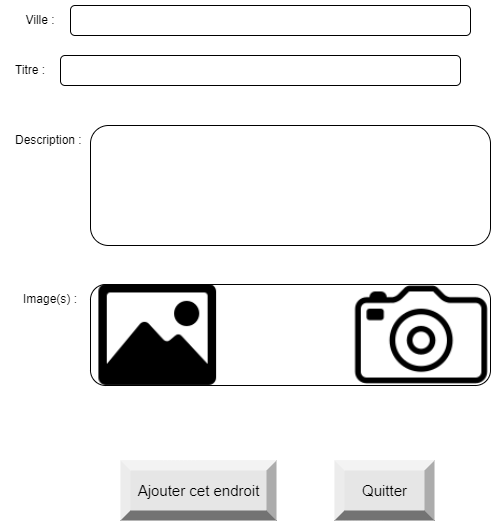

# Guide de mise à jour

Guide de mise à jour pour ajouter un champ ville à la table endroit pour permettre aux utilisateurs de voir et d'ajouter dans quelle ville l'endroit se situe.




Pour commencer, nous allons créer la nouvelle colonne avec une valeur par défaut pour que les endroits déjà créés aillent une valeur dans cette colonne.

SQL à exécuter dans phpmyadmin :
````
ALTER TABLE `endroit` ADD `ville` VARCHAR(255) NOT NULL DEFAULT 'Inconnue' AFTER `description`;
````

## Modifier les scripts php

Dans la classe EndroitDAO, nous devons ajouterle nouveau champ à la fonction ajouter.
````
 public static function ajouterEndroit($endroit){

        $basededonnees = EndroitDAO::initialiser();

        $demandeContrats = $basededonnees->prepare(EndroitDAO::SQL_AJOUTER_ENDROIT);
        $demandeContrats->bindParam(':titre', $endroit['titre'], PDO::PARAM_STR);
        $demandeContrats->bindParam(':description', $endroit['description'], PDO::PARAM_STR);
         $demandeContrats->bindParam(':ville', $endroit['ville'], PDO::PARAM_STR);
        $demandeContrats->execute();

    }
````

Nous devons aussi ajouter le champ au SQL.
````
const SQL_AJOUTER_ENDROIT = 'INSERT INTO endroit(titre, description, ville) VALUES(:titre, :description :ville)';
````

## Modifier les scripts js

Dans la classe EndroitDAO, nous devons ajouterle nouveau champ à la fonction ajouter.

````
    ajouter(endroit){
        let requette = new XMLHttpRequest();

        if(!requette) {
            return null;
        }
        requette.onreadystatechange = function(){

            if (requette.readyState === XMLHttpRequest.DONE) {
                if(requette.status === 200){
                    //alert(requette.responseText);
                }
                else {
                    alert(requette.responseText);
                    return null;
                }
            }
        }

        requette.open('POST', "http://services.mayal.systems/ajouter-endroit.php");
        requette.setRequestHeader('Content-Type', 'application/x-www-form-urlencoded');
        requette.send(`titre=${encodeURIComponent(endroit.titre)}&description=${encodeURIComponent(endroit.description)}&ville=${encodeURIComponent(endroit.ville)}`)
    }
````

## Intégrer les In-app updates

Nous allons utiliser ce plugin pour intégrer les In-app updates à cordova : https://www.npmjs.com/package/cordova-in-app-update?activeTab=readme

Nous devons commencer par installer le plugin avec npm.
````
npm i cordova-in-app-update
````

Ensuite, puisque nous voulons obliger l'utilisateur à faire la mise à jour, nous allons ajouter ce code à l'application pour faire une mise immédiatement.
````
window.plugins.updatePlugin.update(()=>{
    //log en cas de réussite
},()=>{
    //log en cas d'erreur
},{
   ANDROID: {
        type: "IMMEDIATE",
        stallDays: 5
    }
});
````