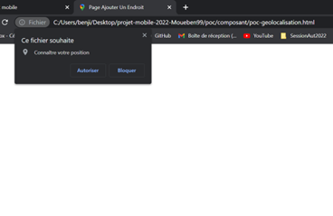
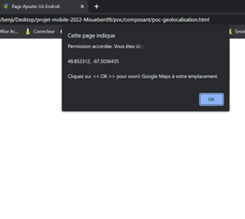
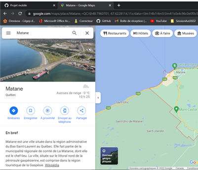

* Capture de la poc de géolocalisation de google maps à la position de l'utilisateur :  
On peut voir le pop up qui souhaite connaitre la position de l'utilisateur :  
  
  
On observe ensuite que la permission est accordée, et il y a les coordonnées (longitude et latitude) qui   s'affichent et qu'il faut cliquer sur OK pour ouvrir google maps :  
  
  
On voit le chargement de la page Google maps :  
  
  
Enfin on voit la carte chargé et qui affiche la position actuelle de l'utilisateur ici qui est Matane  
  
